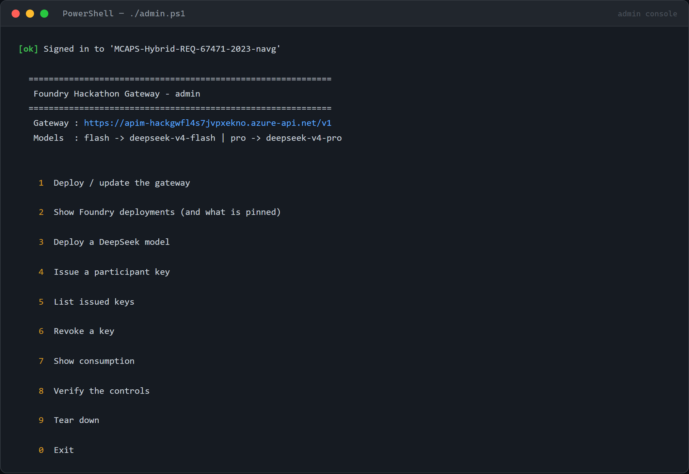
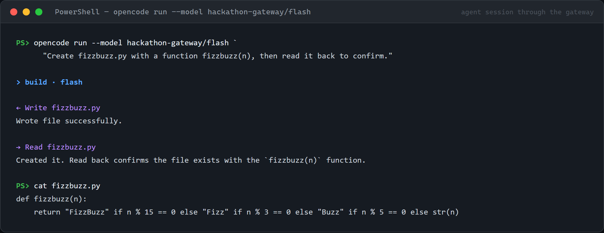
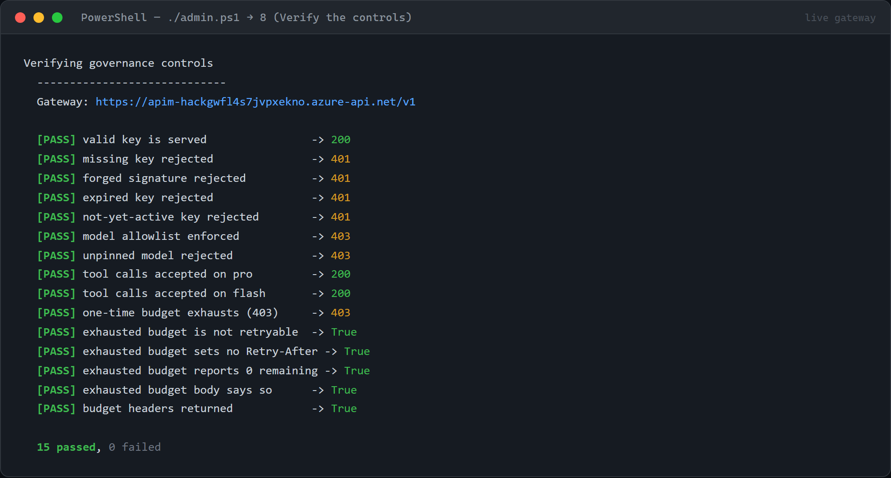
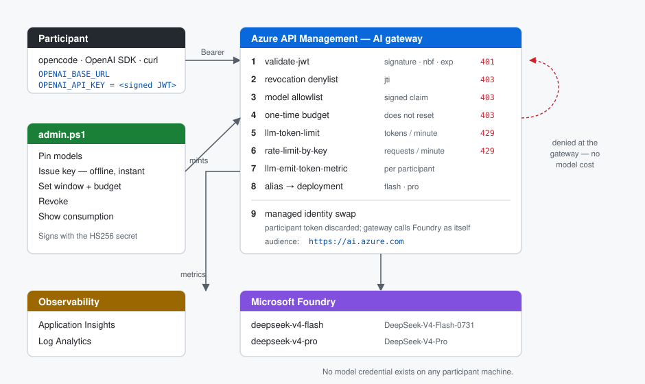

# Foundry Hackathon Gateway

Hand out **time-bound, spend-capped API keys** for models on Microsoft Foundry, so hackathon
participants can build real apps with **opencode** and **Claude Code** — and nobody holds a model
credential or can overspend.

One interactive script does everything.

```powershell
./admin.ps1
```



---

## What a participant gets

Two environment variables and one config file. That is the whole setup.

**[→ Participant setup guide](docs/SETUP.md)** — eight numbered steps, each with a
screenshot, written for someone who has never seen this project.

```bash
OPENAI_BASE_URL=https://<your-gateway>.azure-api.net/v1
OPENAI_API_KEY=eyJhbGciOiJIUzI1NiIsInR5cCI6IkpXVCJ9...
```

They work in `opencode`, the OpenAI SDK, Aider, Continue, `curl` — anything that speaks the OpenAI
wire format.

For **Claude Code**, and anything else speaking the Anthropic Messages API, the same key:

```bash
ANTHROPIC_BASE_URL=https://<your-gateway>.azure-api.net/claude
ANTHROPIC_AUTH_TOKEN=<the same key>
ANTHROPIC_MODEL=<an alias the key grants>
```

`ANTHROPIC_AUTH_TOKEN`, not `ANTHROPIC_API_KEY`. The first is sent as `Authorization: Bearer`,
which is what the gateway validates; the second is sent as `x-api-key` and returns a bare 401.
Option 5 writes a `.claude/settings.json` carrying all three, which is also what makes them apply
to Claude Code's background agents — a shell export does not reach those.

Claude Code is pointed at the gateway as a plain Anthropic endpoint rather than through
`CLAUDE_CODE_USE_FOUNDRY`, so a participant needs no Azure identity at all.
See [ADR-0009](docs/adr/0009-claude-code-connection.md).

The key **is** the entitlement. It carries, signed and untamperable: which models it may call, when
it starts working, when it dies, and how many tokens it may spend. **One key, one budget** — using
both routes draws on the same allowance.

### It really builds things

A real `opencode` session through the gateway — tool calls and all:



And a Claude agent, in a notebook: **[`examples/claude-agent.ipynb`](examples/claude-agent.ipynb)**
builds a two-tool agent on a Claude model in about forty lines of Python, using the ordinary
`anthropic` SDK pointed at the gateway. The committed copy carries the output of a real run
against the live gateway:

```
[turn 1] get_order_status({"order_id": "A-1001"}) -> {"customer": "Ada Lovelace", "total": 129.5, ...}
[turn 1] get_order_status({"order_id": "A-1002"}) -> {"customer": "Alan Turing",  "total": 74.25, ...}
[turn 2] calculate({"expression": "129.5 + 74.25"}) -> {"result": 203.75}
[turn 3] Combined total: $203.75. A-1002 has not yet shipped.

x-governed-by       foundry-hackathon-gateway
x-budget-remaining  197257
```

The notebook reads the key from the environment and never writes it to a cell, which
`tests/example-notebook.test.mjs` enforces.

---

## Quickstart

```powershell
git clone https://github.com/naveenneog/foundry-hackathon-gateway
cd foundry-hackathon-gateway
az login

./admin.ps1
#  1  Deploy / update the gateway     (~5 min, or seconds onto an instance you already run)
#  4  Deploy a new model to Foundry   (if you have not already)
#  5  Issue a participant key
```

**[→ Operator runbook](docs/RUNBOOK.md)** — the whole path with screenshots: deploy or adopt, pin
models, issue keys, prove the controls, hand out, revoke, tear down.
**[→ Statement of work](docs/SOW.md)** — scope, deliverables, acceptance criteria, risks and the
measured limits, for anyone signing this off.

Option 5 writes `handouts/<team>/` containing a ready-to-paste `opencode.json` and a one-page card
for the participant.

### Use an API Management instance you already have

Option 1 lists every API Management instance in the subscription before it creates one:

```
  API Management instances in this subscription.
  Deploying publishes BOTH routes, so both are shown:

    [1] apim-corp                    StandardV2   East US 2
         /v1      add     adds 'deepseek-gateway'
         /claude  add     adds 'claude-gateway'
    [2] apim-legacy                  Developer    East US 2
         /v1      add     adds 'deepseek-gateway'
         /claude  SKIPPED The Claude route is published only on a v2 tier ... on an
                  unsupported tier the token policy is accepted and meters zero, so
                  budgets would never fire.
    [3] Create a new instance
```

Picking an existing instance adds this gateway's API, policy and named values to it and creates
nothing else. Everything written at instance scope is prefixed `hackgw-`, so it cannot collide
with another API published there ([ADR-0008](docs/adr/0008-adopt-existing-apim.md)).

An instance is refused outright when it cannot serve the route being deployed: the Consumption
tier, an instance that is not `Succeeded`, or one with no system-assigned managed identity. A
route that cannot be served is marked `SKIPPED` with its reason, and picking that instance asks
for confirmation first.

**Requirements:** an Azure subscription, a Microsoft Foundry (`AIServices`) account, the Azure CLI,
Node 20+, and **PowerShell 7.0 or later**.

Windows PowerShell 5.1 is **not supported** — it silently corrupts `issued-keys.json`, which breaks
revocation. See [ADR-0006](docs/adr/0006-powershell-7-requirement.md). Install with:

```powershell
winget install --id Microsoft.PowerShell --source winget
```

`admin.ps1` runs a preflight on startup and tells you exactly what is missing:

```
  Preflight
  ---------
  [ok] PowerShell 7.6.5
  [ok] Azure CLI 2.86.0
  [ok] Signed in as <your-account>
       Subscription: Contoso Dev
  [ok] Bicep CLI
  [ok] Node v22.11.0
  [ok] Key minting works
```

---

## The controls

| Control | Participant sees | Measured |
|---|---|---|
| Model allowlist | **403** `model_not_permitted` | exact match; an unpinned alias is refused |
| Access window (start and expiry) | **401** — self-enforcing, no cleanup job | `exp`/`nbf` checked by `validate-jwt`, 60s clock skew |
| One-time spend cap | **403** `budget_exhausted` — stops immediately | stops at **+4%** non-streamed, **+56%** streamed (U15) |
| Revocation | **403** `revoked` | takes effect in **under 10s**; exact id match (U16) |
| Tokens per minute | **429** + `Retry-After` | |
| Requests per minute | **429** | |
| Per-participant attribution | `x-budget-used` header + App Insights | accurate non-streamed; a floor when streaming |
| No credential sprawl | nothing to leak — gateway uses its managed identity | |

Every response carries the live budget:

```
x-budget-used: 29157
x-budget-total: 500000
x-budget-remaining: 470843
```

### What "the key only spends its budget" actually means

Three questions worth separating, because the answers differ:

- **Does it stop at the budget?** Yes. Measured against a 2,000-token budget, it stopped after
  2,080 real tokens non-streamed and 3,120 streamed. The cap is enforced on both; streaming costs
  accuracy, not the control. A single request can always cross the line and finish — the budget
  is checked *before* a call, and the clamp on `max_tokens` is what bounds that last one.
- **Does it stop at the time limit?** Yes, and without anything running. `exp` and `nbf` are
  validated on every request, so a key starts and dies on its own. There is 60 seconds of
  permitted clock skew, and the gateway's clock decides — not the participant's.
- **Does revocation work?** Yes, within seconds (1s and 7s in two measurements, against a 5s
  polling interval), and only on the key you name.

### Verify the controls yourself

`./admin.ps1` → option 11. It mints deliberately broken keys — expired, not yet active, forged,
wrong model, exhausted, revoked — and asserts the gateway rejects each for the right reason, on
every route that has models pinned.



A control that never fires is not a control. The revocation check needs to edit the denylist on
the instance, so it reports **NOT CHECKED** rather than passing when it is run without
`-ApimName` and `-ResourceGroup`.

---

## How it works



A participant's key is a **signed JWT**, not an API Management subscription key. That choice buys
three things:

- **The time window enforces itself.** `exp` and `nbf` are validated on every request by
  `validate-jwt`. No timer job, no reaper, nothing to forget. API Management's own
  `expirationDate` field is [audit metadata the platform never acts on](https://learn.microsoft.com/en-us/azure/api-management/api-management-subscriptions).
- **Issuing a key is offline.** Minting 200 keys takes under a second and zero Azure API calls.
- **It is the native transport.** `opencode` sends `Authorization: Bearer <key>`, and API Management
  validates a subscription key *before* any policy runs — so no policy can rescue that header.

Full reasoning: [ADR-0002](docs/adr/0002-credential-transport.md).

---

## The models

Any number can be pinned, on either route ([ADR-0007](docs/adr/0007-model-map-named-value.md)).
What a route can serve is decided by the wire format the model speaks, not by preference:

| Route | Base URL | Wire format | Foundry endpoint |
|---|---|---|---|
| `v1` | `https://<gw>.azure-api.net/v1` | OpenAI Chat Completions | `/openai/v1` |
| `claude` | `https://<gw>.azure-api.net/claude` | Anthropic Messages | `/anthropic` |

Option 3 lists every deployment in the subscription with the route that serves it, and refuses a
pin that crosses routes — a Claude model on the OpenAI route reaches a backend that has never
heard of it and returns an opaque 404.

The default DeepSeek pins:

| Alias | Foundry deployment | Best for |
|---|---|---|
| `flash` | `DeepSeek-V4-Flash-0731` | **Default.** Agent loop, file edits. Faster, cheaper. |
| `pro` | `DeepSeek-V4-Pro` | Hard reasoning. Slower, pricier. |

Both support tool calling, so both work in `opencode`.

Claude models are deployed in the Foundry portal rather than from here: they need organisation
details and Azure Marketplace terms that the CLI cannot supply
([UNKNOWNS U14](docs/UNKNOWNS.md)). Once deployed, pin one with option 3.

The Claude route needs an API Management **v2** tier. `llm-token-limit` parses the Anthropic
Messages shape on v2 tiers only; on a classic tier it meters zero tokens and a budget would never
fire, so the route is not published there.

Verified live on 2026-08-31 — a single `opencode` run through the gateway used **Grep**, **Bash**,
**Read** and **Write**:

```
> build · flash
✱ Grep "TODO" in src · 2 matches
$ (Get-ChildItem -Path src -File).Count
3
← Write REPORT.md
Wrote file successfully.
Done. Files with TODOs: src/alpha.py, src/gamma.py. Total files in src/: 3.
```

> Microsoft Learn states `DeepSeek-V4-Pro` *"doesn't support tool calling"*. Live testing
> disproved it — it returns well-formed `tool_calls`. An earlier version of this gateway
> hard-blocked tools on `pro` on the strength of that doc; the block was removed before shipping.
> The verification harness asserts tool calling on both models, so a genuine future regression is
> caught by the harness rather than by a participant mid-build. See
> [ADR-0003](docs/adr/0003-model-roles.md).

---

## Tuning

Limits are API Management named values, so changing one is a config edit, not a redeployment.
Every name is prefixed `hackgw-`, so nothing here can collide with another API on a shared
instance ([ADR-0008](docs/adr/0008-adopt-existing-apim.md)):

| Named value | Default | Meaning |
|---|---|---|
| `hackgw-tpm-per-key` | 40,000 | tokens/minute per participant |
| `hackgw-calls-per-minute` | 240 | request ceiling per participant |
| `hackgw-max-output-tokens` | 8,192 | hard cap on any single completion |
| `hackgw-model-map` | — | `alias=deployment;alias=deployment` ([ADR-0007](docs/adr/0007-model-map-named-value.md)) |
| `hackgw-revoked-keys` | `,` | denylist, managed by `admin.ps1` |
| `hackgw-signing-key` | — | HS256 secret; rotating it invalidates every outstanding key |

```powershell
az apim nv update -g rg-hackathon-gateway --service-name <apim> `
    --named-value-id hackgw-max-output-tokens --value 4096
```

**Emergency stop:** rotating `hackgw-signing-key` invalidates every outstanding key at once.

A gateway deployed before the prefix existed still has the old unprefixed names. `admin.ps1`
reads either, and the next deployment writes only the prefixed ones — the old values are left in
place and are no longer read, so delete them once the gateway has been redeployed.

### If two people run the event

The signing secret lives in `.gateway/secret.txt`, which is **gitignored** — cloning the repo
does not give you a working one. Keys minted with a different secret than the gateway holds are
rejected with a bare `401`, and the gateway's message cannot tell you why.

- **One organiser mints keys.** Simplest, and the default assumption.
- **Or copy `.gateway/secret.txt`** to the second machine out of band. Treat it like a password —
  it can mint a key for anyone, with any budget, for any model.
- **Do not re-run option 1 on a second machine** without that file. It generates a new secret,
  redeploys, and silently invalidates every key the first machine issued.

`admin.ps1` catches this on startup and refuses to continue:

```
[x]  Signing secret does NOT match the deployed gateway.
     Every key minted here would be rejected with 401.
```

Menu option **9 — Why is a key being rejected?** takes a key and names the actual cause
(wrong secret, not yet active, expired, revoked, or a model the gateway has not pinned)
instead of the gateway's one-size-fits-all message.

---

## Cost

| Item | Approx |
|---|---|
| API Management Basic v2, 1 unit | ~$250/month — **nothing if you adopt an instance you already run** |
| Log Analytics + Application Insights | ingestion-based, small at this volume |
| DeepSeek tokens | pay-per-token, unchanged by the gateway |
| Claude tokens | billed as Claude Consumption Units through Azure Marketplace |

The gateway bills whether or not anyone uses it. Tear it down when the event ends:

```powershell
./admin.ps1   # option 12
az apim deletedservice purge --service-name <apim-name> --location <region>
```

`purge` matters — a soft-deleted API Management instance keeps its globally unique name.

Model deployments in the Foundry account are left alone; the gateway did not create them.

---

## Repository layout

```
admin.ps1                    interactive admin console — start here
src/
  entitlement.mjs            the access decision, as a pure tested function
  keys.mjs                   HS256 key minting and verification (zero dependencies)
  models.mjs                 the alias map, parsed and built
  apim.mjs                   which API Management instance can host this, and why not
  foundry.mjs                the models in the subscription, and the route that serves each
  anthropic.mjs              the Anthropic error envelope and body rewrites
infra/
  main.bicep                 gateway, observability, both APIs, policy, RBAC
  policy.xml                 the governance policy, OpenAI route
  policy-claude.xml          the governance policy, Claude route
scripts/
  mint.mjs                   thin shim so admin.ps1 never reimplements JWS
  Apim.ps1                   instance discovery and named-value access
  Models.ps1                 model discovery and pinning
  Keys.ps1                   key issuance and handouts
  Test-Governance.ps1        proves each control fires, per route
examples/
  claude-agent.ipynb         a tool-calling Claude agent, with a real recorded run
tests/                       328 tests, including tamper and alg:none attacks
docs/adr/                    architecture decisions and their reasoning
docs/UNKNOWNS.md             what we did not know, and how each was closed
```

`src/*.mjs` is the canonical statement of the rules; the policies and the PowerShell are
transcriptions of it. **Change one, change both** — the unit tests guard the modules, static
parity tests guard the transcriptions, and `Test-Governance.ps1` guards the deployed behaviour.

```powershell
npm test                                  # 70 tests
node .ironclad/gate.mjs --stage packet    # full quality gate
```

---

## Known limits

- **A single call can overshoot a small budget.** The budget is checked *before* a request, so the
  request that crosses the line still completes. Measured: a 300-token budget was overshot to 3,507
  by one call. The overshoot is bounded by one request — roughly `prompt + max-output-tokens`
  (default 8,192) — so it is negligible against a realistic budget and material only if you issue
  very small ones. Subsequent calls are refused.
- **Streaming drifts the counter.** API Management estimates tokens on streamed responses rather
  than reading actual usage, so `x-budget-used` is approximate. The `token-quota` underneath is the
  authoritative cap. See `docs/UNKNOWNS.md` U5.
- **On the Claude route a streamed budget overshoots by about half again.** Measured 2026-10-04
  with a 2,000-token budget and 500-token requests: non-streamed stopped at **2,080** real tokens
  (+4%), streamed stopped at **3,120** (+56%). The budget is enforced on both — what streaming
  costs is accuracy, not the control. `x-budget-used` is the part that genuinely breaks: it read
  108 where 3,120 had been spent, because the header is fed by the cache counter and the cap is
  enforced by APIM's own quota. **Treat `x-budget-used` as a floor on the Claude route, not a
  figure.** Claude Code always streams. See `docs/UNKNOWNS.md` U15 and roadmap P20.
- **The budget counter uses the internal cache**, which is best-effort and not atomic under
  concurrency. The quota backstop bounds the damage. Move to external Redis if this outlives one
  event — roadmap P11.
- **A Claude Code release can advertise a capability Foundry rejects.** Claude Code lists each
  feature as a value in `anthropic-beta`, and the gateway forwards that header verbatim because
  the protocol requires it. Foundry returns **400** naming any value it does not recognise —
  observed with `advisor-tool-2026-03-01`. Running against a scratch `CLAUDE_CONFIG_DIR` avoids
  it, and is the recommended setup anyway. See `docs/UNKNOWNS.md` U17 and roadmap P23.
- **JWTs cannot be revoked before `exp`** — the trade for offline issuance. The `jti` denylist
  covers it at the cost of one named-value update, which takes effect in under ten seconds
  (measured; `docs/UNKNOWNS.md` U16).

---

## License

MIT
