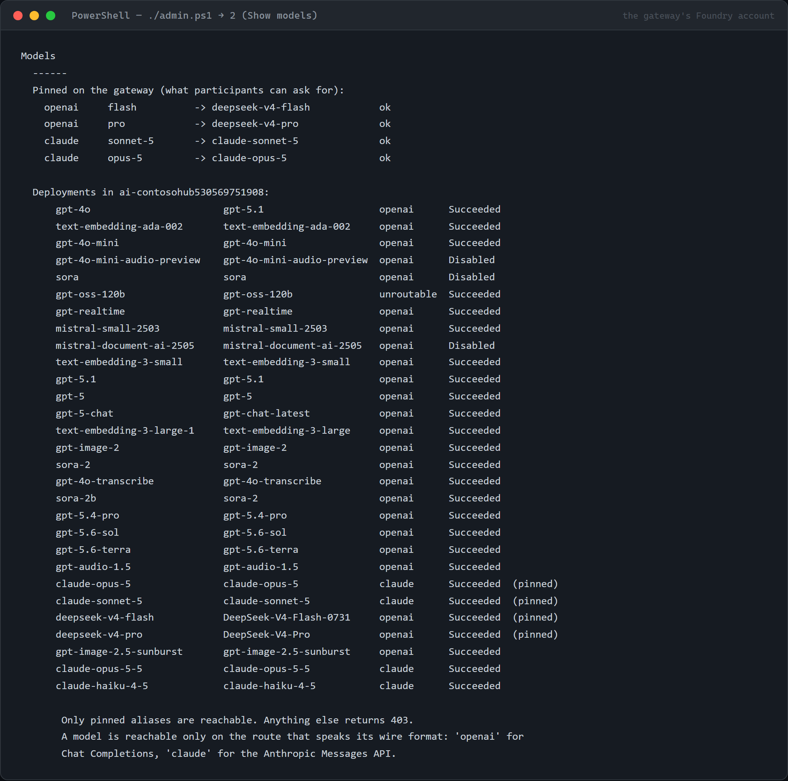
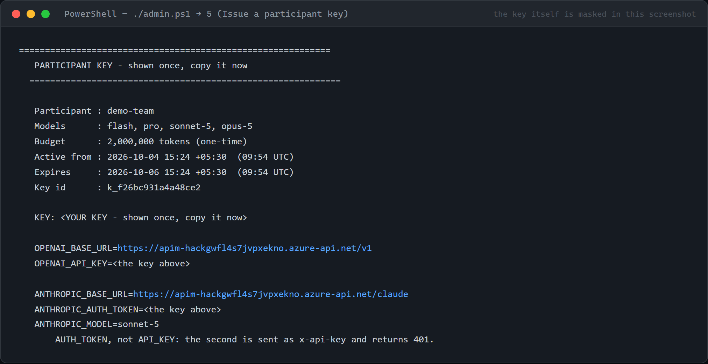
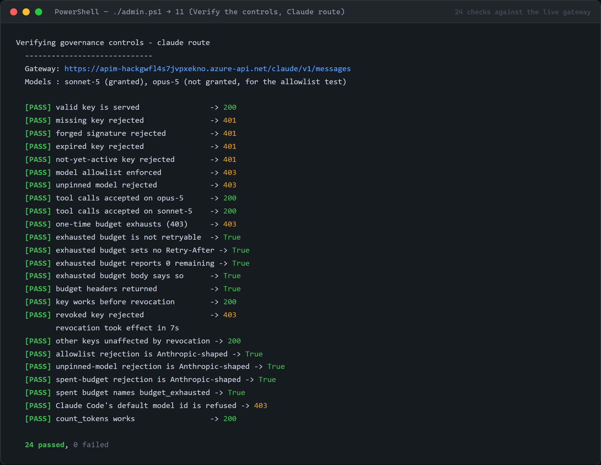
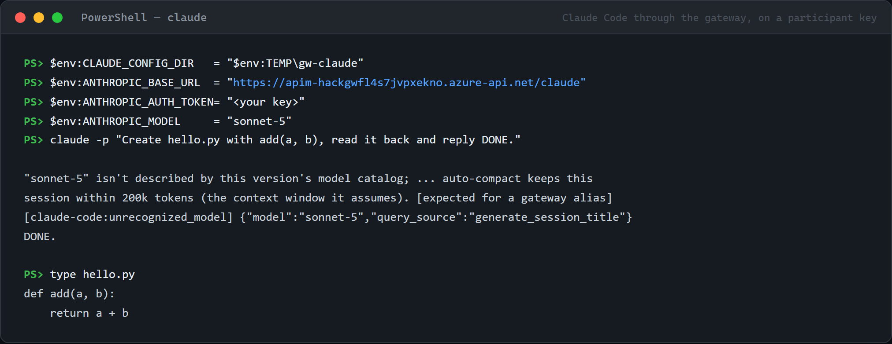
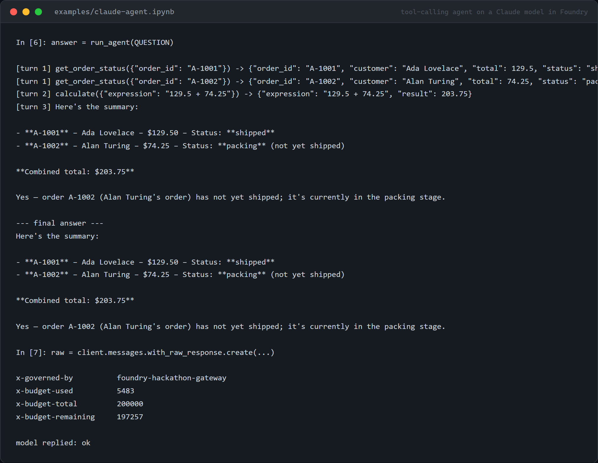

# Runbook — running the gateway yourself

This is the organiser's guide: deploy the gateway, pin models, issue keys, prove the controls
work, and hand keys out. It assumes nothing has been set up yet.

The participant-facing guide is [SETUP.md](SETUP.md) — give that to the people receiving keys.

Every screenshot here is a capture from a live run, not a mock-up.

---

## What to expect

| | |
|---|---|
| Time, onto an API Management instance you already run | minutes |
| Time, creating a new instance | 30–45 minutes, mostly waiting for API Management |
| Cost while idle | API Management BasicV2, plus Log Analytics ingestion |
| Cost per participant | model tokens only, capped by the key |
| What changes on your machine | a `.gateway/` folder holding local state and the signing secret |

The signing secret in `.gateway/secret.txt` can mint a key for anyone, with any budget, for any
model. It is gitignored. Treat it as the master credential for the event.

---

## Before you start

| Requirement | Check |
|---|---|
| PowerShell 7.0+ | `pwsh --version` — Windows PowerShell 5.1 corrupts `issued-keys.json` ([ADR-0006](adr/0006-powershell-7-requirement.md)) |
| Azure CLI | `az version` |
| Node 20+ | `node --version` |
| Signed in | `az account show` |
| A Foundry account with models deployed | `az cognitiveservices account list --query "[?kind=='AIServices'].name" -o tsv` |

Claude models have to be deployed in the Foundry portal rather than from here: they need
organisation details and Azure Marketplace terms the CLI cannot supply ([UNKNOWNS](UNKNOWNS.md)
U14). Everything else can be deployed from option 4.

`admin.ps1` checks all of this on startup and names anything missing.

---

## Step 1 — Open the console

```powershell
git clone https://github.com/naveenneog/foundry-hackathon-gateway
cd foundry-hackathon-gateway
./admin.ps1
```


The header shows both route URLs and every pinned model with the route that serves it. Before the
first deployment it says "Not deployed yet".

---

## Step 2 — Deploy, or adopt an instance you already have

Option **1**.

It lists every API Management instance in the subscription, shows what deploying would do to
**each route**, then offers to create a new one as the last choice:

```
  API Management instances in this subscription.
  Deploying publishes BOTH routes, so both are shown:

    [1] apim-corp                    StandardV2   East US 2
         /v1      add     adds 'deepseek-gateway'
         /claude  add     adds 'claude-gateway'
    [2] apim-legacy                  Developer    East US 2
         /v1      add     adds 'deepseek-gateway'
         /claude  SKIPPED The Claude route is published only on a v2 tier (BasicV2,
                  StandardV2 or PremiumV2) ... on an unsupported tier the token policy
                  is accepted and meters zero, so budgets would never fire.
    [3] apim-other                   BasicV2      East US 2
         /v1      add     adds 'deepseek-gateway'
         /claude  SKIPPED The API 'claude-foundry' already serves the path 'claude' on
                  this instance, and APIM requires paths to be unique.
    [4] Create a new instance
```

Deploying publishes both APIs, so both are shown per instance. A route marked `SKIPPED` will not
be published and the reason says why — a tier that cannot meter Anthropic tokens, or another API
already occupying the path. Picking an instance where the Claude route is skipped asks for
confirmation before continuing.

Picking an existing instance adds this gateway's APIs, policy and named values to it and creates
nothing else. Everything written at instance scope is prefixed `hackgw-`, so it cannot collide
with another API published there ([ADR-0008](adr/0008-adopt-existing-apim.md)).

The instance that already carries this gateway shows `update` rather than `add` on each route.

You are then asked for the Foundry account. Pick the one holding the models you intend to use —
the gateway can only reach deployments in that single account.

If that account's public network access is disabled, the instance has to be Standard v2 or
Premium v2 with outbound virtual network integration; Basic v2 cannot reach it. See
[PRIVATE-ENDPOINT.md](PRIVATE-ENDPOINT.md).

---

## Step 3 — Pin the models

Option **3**.



The picker lists the deployments in the gateway's Foundry account — the account chosen in step 2
— with the route that can serve each one. Deployments in other accounts are not listed: both
routes point at the one account, so a deployment elsewhere answers 404
([ADR-0011](adr/0011-pin-from-the-gateways-account.md)). If no account has been chosen yet,
option 3 asks for one first. The route is decided by the model's wire format, not by
preference: Claude models speak the Anthropic Messages API and are reachable only on the `claude`
route; everything else speaks OpenAI Chat Completions and is reachable only on `v1`. A pin that
crosses routes is refused.

Two rules for Claude aliases:

- Keep the version. `sonnet-5` works; a bare `sonnet` does not. Claude Code resolves `sonnet`,
  `opus` and `haiku` to its own model ids before the request leaves the machine, so the gateway
  never sees the alias you pinned ([UNKNOWNS](UNKNOWNS.md) U13). The picker refuses those names.
- A pin whose deployment is not in the gateway's account is shown as `MISSING` in option 2, and
  the deployment plan in option 1 marks it `BLOCKED`.

Saving pushes the alias map to the live gateway. No redeployment is needed
([ADR-0007](adr/0007-model-map-named-value.md)).

---

## Step 4 — Issue a key

Option **5** for one key, option **6** for a batch.



The key is shown once. It is a signed JWT carrying, tamper-proof: which aliases it may call, when
it starts working, when it dies, and how many tokens it may spend. Nothing is stored server-side
except the revocation id.

Option 5 also writes `handouts/<team>/` containing:

| File | For |
|---|---|
| `README.md` | the participant's card — both routes, the troubleshooting table |
| `opencode.json` | drop into a project, then run `opencode` |
| `.claude/settings.json` | the three Claude Code variables, including for background agents |

`handouts/` is gitignored because those files contain live keys. `README.md` and
`settings.json` hold the key and are readable only by the operator who wrote them.

**Base URL.** Issuance asks once for the hostname in participants' base URLs. The default is the
gateway's custom domain when the instance has one (a gateway hostname in its custom domains), then
a hostname typed here before (for a front door or application gateway the instance does not
report), then the built-in `*.azure-api.net` name. Only the host changes; each route keeps its
path. A wildcard custom domain (`*.contoso.com`) is not offered, because it is not one address.
A pasted URL is reduced to its host; a port other than 443 is reported, because participants'
URLs use https on 443.

**A batch.** Option 6 writes one folder per participant under `handouts/batch-<time>/`, plus:

| File | Contents |
|---|---|
| `keys.csv` | one row per participant: `participant`, `key`, `key_id`, `models`, `openai_base_url`, `anthropic_base_url`, `anthropic_model`, `budget_tokens`, `valid_from_utc`, `valid_until_utc`. Readable only by the operator ([ADR-0012](adr/0012-bulk-keys-in-one-csv.md)) |
| `index.csv` | who got which key id, without the keys |

A participant name that starts with `=`, `+`, `-`, `@`, a tab or a carriage return is written with
a leading apostrophe in both files, so a spreadsheet does not run it as a formula; the key itself
carries the name as given.

**The key list.** Option 7 moves keys more than ten minutes past their expiry to
`.gateway/issued-keys-archive.json` and lists the rest. An id used by an archived key still counts
when a new key is issued: budget, rate limit and quota are keyed on the id, so an earlier key's
spend can count against the new one. When the archive file exists but cannot be read, nothing
is moved and option 7 reports it; the file is left as it is.

---

## Step 5 — Prove the controls work

Option **11**. It runs once per route that has models pinned.



It mints deliberately broken keys — expired, not yet active, forged, wrong model, exhausted,
revoked — and asserts the gateway rejects each for the right reason. A control that never fires
is not a control.

The revocation check edits the denylist on the instance, so it runs only when the console passes
`-ApimName` and `-ResourceGroup`, which it does. Run standalone without them and it reports
**NOT CHECKED** rather than passing.

To run it directly:

```powershell
./scripts/Test-Governance.ps1 `
    -GatewayUrl https://<your-apim>.azure-api.net/claude `
    -SecretPath .gateway\secret.txt `
    -Route claude -Model sonnet-5 -SecondModel opus-5 `
    -ApimName <your-apim> -ResourceGroup <your-rg>
```

---

## Step 6 — Use a key

### Claude Code

```powershell
$env:CLAUDE_CONFIG_DIR    = "$env:TEMP\gw-claude"
$env:ANTHROPIC_BASE_URL   = "https://<your-apim>.azure-api.net/claude"
$env:ANTHROPIC_AUTH_TOKEN = "<the key>"
$env:ANTHROPIC_MODEL      = "sonnet-5"
claude
```



`CLAUDE_CONFIG_DIR` points Claude Code at a scratch configuration directory. It matters for two
reasons, both found by testing on a machine that already had Claude Code set up:

- An existing `~/.claude/settings.json` carrying `model`, `availableModels`,
  `ANTHROPIC_DEFAULT_*_MODEL` or `CLAUDE_CODE_USE_FOUNDRY` overrides these variables — including
  over a project settings file — and requests go to the old destination.
- Some Claude Code features advertise capabilities in `anthropic-beta` that Foundry rejects with
  a 400 naming the value ([UNKNOWNS](UNKNOWNS.md) U17).

Closing the terminal restores everything. `/status` shows which base URL and credential are
actually in use.

Claude Code will say the model "isn't described by this version's model catalog" and assume a
200K context window. That is expected for a gateway alias, and it under-reports rather than
over-reports.

### opencode

```powershell
$env:OPENAI_BASE_URL = "https://<your-apim>.azure-api.net/v1"
$env:OPENAI_API_KEY  = "<the key>"
```

Copy the handout's `opencode.json` into the project and run `opencode`. Full participant steps
are in [SETUP.md](SETUP.md).

### Python

[`examples/claude-agent.ipynb`](../examples/claude-agent.ipynb) builds a tool-calling agent on a
Claude model with the ordinary `anthropic` SDK. The committed copy holds a real run.



---

## Step 7 — Revoke a key

Option **8**. It takes effect in under ten seconds, and only on the key named — the denylist is
matched with sentinel commas, so revoking `k_a` cannot revoke `k_aaa` ([UNKNOWNS](UNKNOWNS.md)
U16).

Revocation is the only control that needs an action. Expiry and the budget stop the key on their
own.

Option 8 archives expired keys first, so they are not offered for revocation, and the denylist it
pushes holds the current keys' revocations only. An archived key is more than ten minutes past its
expiry, beyond the gateway's 60-second clock skew, so its expiry refuses it without the list.

---

## Step 8 — Tear down

Option **12**, or by hand:

```powershell
az group delete -n <your-rg> --yes --no-wait
az apim deletedservice purge --service-name <your-apim> --location <region>
```

The purge matters: a soft-deleted API Management instance keeps its name reserved.

Model deployments in the Foundry account are left alone — the gateway did not create them.

---

## When something fails

| What you see | Cause | Fix |
|---|---|---|
| `401` on every request | The key is in `ANTHROPIC_API_KEY`, so it was sent as `x-api-key` | Use `ANTHROPIC_AUTH_TOKEN` |
| `401`, and the preflight warns about the signing secret | The gateway holds a different secret from this machine | Copy `.gateway/secret.txt` from the machine that deployed it, or redeploy |
| `403 model_not_permitted`, naming a model nobody asked for | A bare `sonnet`/`opus`/`haiku` alias, or an existing Claude Code config | Use the versioned alias; set `CLAUDE_CONFIG_DIR` |
| `403 model_not_configured` | The alias is on the key but not pinned on the gateway | Option 3, then save |
| `403 budget_exhausted` | The budget is spent. One-time, does not reset | Issue a new key |
| `400` naming `anthropic-beta` | Claude Code advertised a capability Foundry does not accept | Scratch `CLAUDE_CONFIG_DIR` as above |
| `404 DeploymentNotFound` | The gateway points at a Foundry account without those deployments | Re-run option 1 and pick the right account |
| Option 9 | Takes a rejected key and names the actual cause | |

---

## Known limits

Worth reading before quoting a budget to anyone: [README — Known limits](../README.md#known-limits).
The short version is that on the Claude route `x-budget-used` is a floor rather than a figure,
because Claude Code streams and the header does not count streamed completions. The cap itself
holds — measured, a 2,000-token budget stopped at 3,120 real tokens streamed and 2,080
non-streamed ([UNKNOWNS](UNKNOWNS.md) U15).
