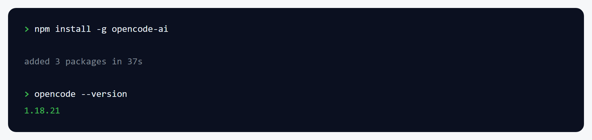
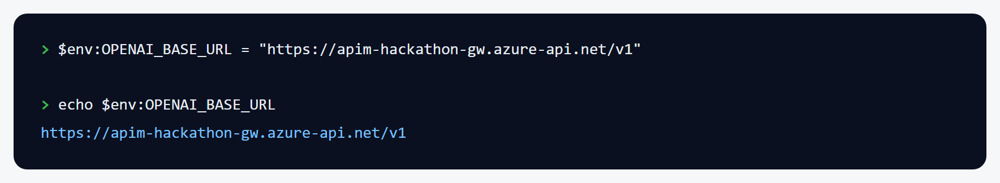
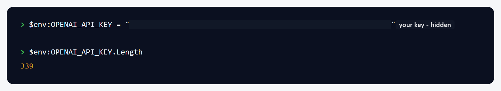
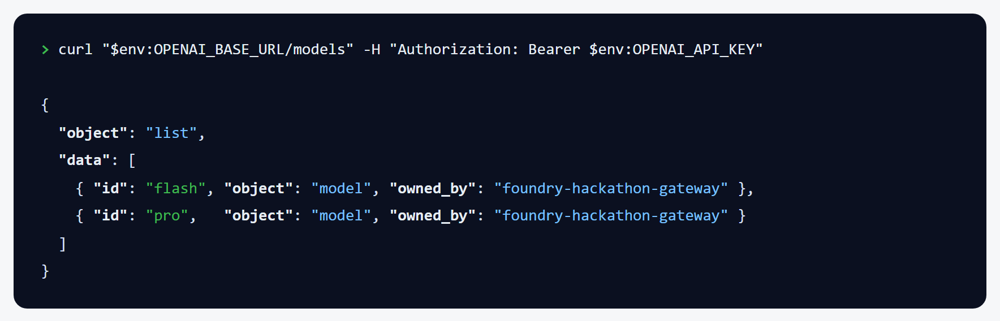
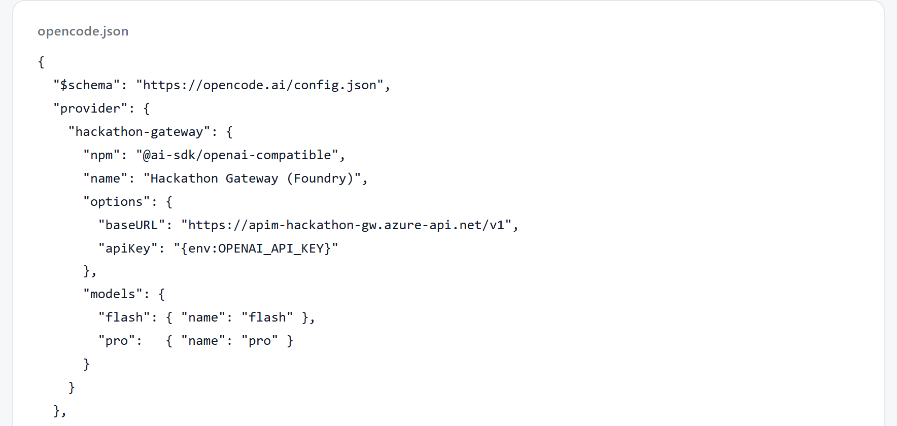
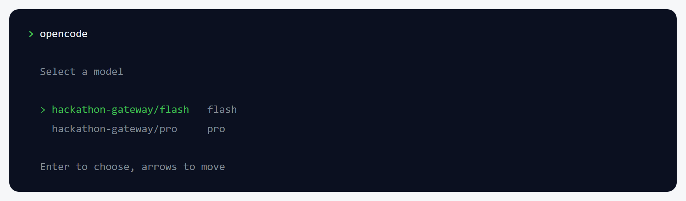
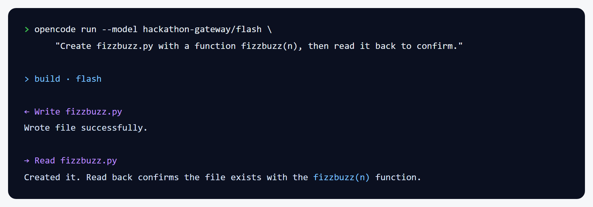
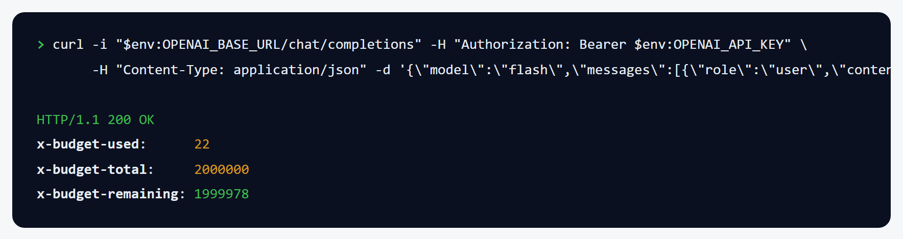

# Hackathon gateway - setup guide

Get the AI coding agent `opencode` working with the key an organiser gave you.

---

## What to expect

| Question | Answer |
|---|---|
| How long does it take? | About 10 minutes. |
| Does it cost money? | No. The organiser pays. Your key has a fixed token budget. |
| What changes on my computer? | One global npm package (`opencode-ai`), two environment variables, and one file named `opencode.json` in your project folder. |
| Do I need admin rights? | No. |
| Do I need internet? | Yes, for every step. |
| What it does **not** do | It does not give you an OpenAI account. The key only works with this gateway. |

At the end you can ask `opencode` to write code, and it will read and write files in your
project folder.

---

## Before you start

| # | You need | Version | Check it with | Where to get it |
|---|---|---|---|---|
| 1 | Node.js | 20 or newer | `node --version` | <https://nodejs.org> |
| 2 | Your key card | - | The organiser gave you a folder with `README.md` and `opencode.json` inside | Ask an organiser |
| 3 | A project folder | - | Any empty folder you want to build in | Make one |

Your key card folder holds two things you need:

- the **gateway address**, which starts with `https://`
- your **key**, a long string that starts with `eyJ`

Keep the key private. It spends real budget. Do not paste it into chat or commit it.

---

## Check your machine is ready

Run this from your project folder:

```powershell
pwsh scripts\preflight.ps1 -Manifest scripts\preflight.json
```

**What you should see**

```text
Hackathon gateway - participant setup - preflight check
=======================================================

[ OK ] Node.js 20+              26.1.0 (need 20.0.0 or newer)
[ OK ] opencode installed       found at ...\npm\opencode.ps1
[ OK ] Gateway is reachable     https://your-gateway/v1/models answered 401
[WARN] Gateway address is set   OPENAI_BASE_URL is not set
[WARN] Your key is set          OPENAI_API_KEY is not set
[ OK ] Model list in this folder opencode.json is there

4 passed, 0 failed, 2 warning(s).
Ready. You can start at Step 1.
```

The two `[WARN]` lines are correct before you start. You fix them in Step 2 and Step 3.
A `401` on the reachability line is also correct. It proves the gateway is running and
wants a key.

---

## Steps

### Step 1 - Install opencode

**Do this**

Run this command.

```powershell
npm install -g opencode-ai
```

**What you should see**

`npm` reports the packages it added. Then `opencode --version` prints a version number.



> **If that did not happen:** you see `npm: command not found` -> Node.js is not
> installed. Install it from <https://nodejs.org>, close the terminal, open it again,
> then do Step 1 again.

---

### Step 2 - Set the gateway address

**Do this**

Copy the address from your key card. Put it in this command in place of the example.

```powershell
$env:OPENAI_BASE_URL = "https://your-gateway.azure-api.net/v1"
```

**What you should see**

Nothing. The command prints no output. Run `echo $env:OPENAI_BASE_URL` and it prints the
address back.



> **If that did not happen:** the echo prints an empty line -> you opened a new terminal.
> Environment variables only live in the terminal that set them. Do Step 2 again in the
> terminal you are using.

---

### Step 3 - Set your key

**Do this**

Copy the key from your key card. Put it in this command in place of the example.

```powershell
$env:OPENAI_API_KEY = "<PASTE-YOUR-KEY-HERE>"
```

**What you should see**

Nothing. The command prints no output. Run `$env:OPENAI_API_KEY.Length` and it prints a
number above 300.



**Keep this key private.** It is the only copy you get.

> **If that did not happen:** the length is `0` -> the paste did not include the whole
> key. Copy it again from your key card and do Step 3 again.

---

### Step 4 - Check your key works

**Do this**

Ask the gateway which models your key can use.

```powershell
curl "$env:OPENAI_BASE_URL/models" -H "Authorization: Bearer $env:OPENAI_API_KEY"
```

**What you should see**

A list of the models on your key. Most keys show `flash` and `pro`.



> **If that did not happen:** you see `401` -> your key is wrong, expired, or not yet
> active. Check the dates on your key card, then ask an organiser for a new key.

---

### Step 5 - Add the model list to your project

**Do this**

Copy `opencode.json` from your key card folder into your project folder.

```powershell
Copy-Item <your-key-card-folder>\opencode.json .
```

**What you should see**

A file named `opencode.json` in your project folder. It names the gateway, the models you
may use, and the `apiKey` line that reads the key you set in Step 3.



The `apiKey` line must say `{env:OPENAI_API_KEY}`. Without it, Step 4 passes but
`opencode` still returns `401`.

> **If that did not happen:** you see `Cannot find path` -> you are not in your project
> folder, or the path to the key card is wrong. Check both paths, then do Step 5 again.

---

### Step 6 - Start opencode

**Do this**

Run this from your project folder.

```powershell
opencode
```

**What you should see**

A model picker listing `hackathon-gateway/flash` and `hackathon-gateway/pro`. Choose
`flash` with the arrow keys and press Enter.



Use `flash` to build. Use `pro` for hard reasoning questions.

> **If that did not happen:** the picker is empty -> `opencode.json` is not in this
> folder. Do Step 5 again, then do Step 6 again.

---

### Step 7 - Ask it to build something

**Do this**

Type a request and press Enter.

```text
Create fizzbuzz.py with a function fizzbuzz(n), then read it back to confirm.
```

**What you should see**

`opencode` writes the file, reads it back, and tells you it is done. The lines starting
with an arrow are it using tools on your folder.



You now have a real `fizzbuzz.py` in your folder.

> **If that did not happen:** you see `403 model_not_permitted` -> you asked for a model
> that is not on your key. Run Step 4 to see what you have.

---

### Step 8 - Check how much budget is left

**Do this**

Every reply carries your budget in its headers. Ask for them.

```powershell
curl -i "$env:OPENAI_BASE_URL/chat/completions" -H "Authorization: Bearer $env:OPENAI_API_KEY" -H "Content-Type: application/json" -d '{\"model\":\"flash\",\"messages\":[{\"role\":\"user\",\"content\":\"hi\"}]}'
```

**What you should see**

Three headers near the top of the reply.



`x-budget-remaining` is what you have left. It does not reset.

---

## Check it worked

Run the preflight again.

```powershell
pwsh scripts\preflight.ps1 -Manifest scripts\preflight.json
```

Every line now says `[ OK ]`, and the last line says `Ready. You can start at Step 1.`
If you see that, you are done.

---

## Common problems

| What you see | Why it happens | What to do |
|---|---|---|
| `401` on any call | The key is wrong, expired, or not active yet | Check the dates on your key card. Ask an organiser for a new key. |
| `403 model_not_permitted` | You asked for a model your key does not include | Run Step 4 to list your models. Use one of those. |
| `403 budget_exhausted` | You spent your whole budget. It does not reset. | Ask an organiser. Retrying will not help. |
| `403 revoked` | An organiser turned this key off | Ask an organiser why. |
| `429` | You went too fast | Wait. Your tool retries on its own. |
| Model picker is empty | `opencode.json` is not in this folder | Do Step 5 again. |
| Step 4 works but `opencode` says `401` | `opencode.json` is missing the `apiKey` line | Add `"apiKey": "{env:OPENAI_API_KEY}"` inside `options`, then do Step 6 again. |
| Everything works, then stops after you open a new terminal | Environment variables only live in one terminal | Do Step 2 and Step 3 again in the new terminal. |

Only the `429` is worth retrying. The rest are final, and your agent stops instead of
looping.

---

## Clean up

To undo everything in this guide:

```powershell
npm uninstall -g opencode-ai
```

Then delete `opencode.json` from your project folder, and close the terminal to clear the
two environment variables.

Your key stops working on its own at the time printed on your key card. Nothing keeps
charging after the event.

---

## Where to get help

Ask an organiser. Tell them the exact error text and which step you were on.
